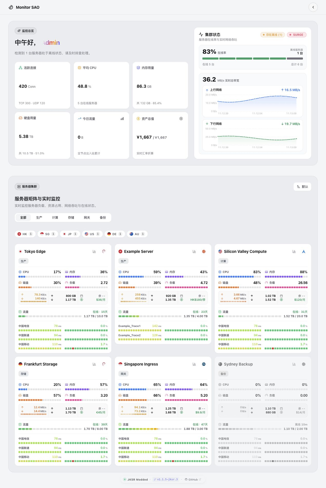

# Monitor-SAO · JKSR Modded

本 Fork 在 Monitor-SAO 基础上增加逐服务器多线路和独立丢包色带，版本为 `1.1.5-jksr.1`。保持主题短名 `sao`，沿用原站点配置。

- **逐服务器线路**：在“主题设置 → 延迟”选择跟随全局、自动或自定义；按节点 ID/UUID 保存，自定义支持 1–8 个任务及排序。例如普通节点跟随 CT/CU/CM，Po0 单独显示 PL、CT-53。
- **全局空槽位**：允许删除最后一个槽位或全部清空，保存后仍为空；开启全局多线路时，空列表表示按各节点关联任务自动展示。
- **明确的覆盖规则**：逐节点自动/自定义优先于全局和旧单线路绑定；跟随全局保留旧行为，提供旧绑定迁移按钮。
- **独立丢包色带**：关闭色带后延迟图表向上补位；色带和线路开关保留图表实例与横轴缩放，线路显隐按需要更新纵轴。
- **统一卡片与样式**：大卡、小卡、迷你卡、列表共用选线规则；修复下拉箭头内距，页脚署名为 `JKSR Modded`。

完整的配置兼容说明、验证结果和截图见 [审查说明](docs/jksr-review/README.md)。服务器部署仍需先审查成品。

## 获取本 Fork 安装包

1. 在 [本 Fork Releases](https://github.com/michaeloversea/Monitor-SAO-Mod/releases) 下载对应版本的 `theme.tar.gz`。
2. 在极简探针后台主题管理中直接上传 `theme.tar.gz` 并启用，无需解压。
3. 打开“主题设置 → 延迟”，为全局和 Po0 选择实际任务并保存。检测任务的创建与关联仍由探针后台负责。

也可以本地构建：`npm ci` 后运行 `npm run lint`、`npm run typecheck`、`npm test` 和 `npm run package`，安装包输出在仓库根目录。未发布版本的构建产物可在 [Actions](https://github.com/michaeloversea/Monitor-SAO-Mod/actions/workflows/build-package.yml) 下载 `sao-theme-package`，解压外层 ZIP 后取出 `theme.tar.gz`。

以下保留上游 SAO 系列功能说明与致谢。

  <strong>面向多种探针服务端的 SAO 系列探针主题</strong>

  
  
  

  

---

## ⚡ 核心通用特性

### 1. 极致加载速度优化

- **早期数据并行预取**：在 HTML `<head>` 阶段通过内联脚本并行发起数据请求，彻底告别单页应用常见的串行等待。
- **立体骨架屏秒级占位**：在首屏真实数据抵达前渲染结构对齐的呼吸骨架，有效缓解页面等待空白感。
- **构建按需分包加载**：对图表库等重型依赖异步拆包加载，严格控制首屏核心脚本体积。

### 2. 界面设计与视觉体验

- **双栏总览仪表盘**：
  - **核心指标区**：汇总活跃连接、CPU、内存磁盘占用、今日流量与资产等运维指标。
  - **集群状态看板（右侧核心区）**：
    - **双形态展现形式自由切换**：支持在主题设置中自由选择「经典波形」或全新「方格矩阵」展示模式，兼顾宏观拓扑俯瞰与深度指标监控。
    - **全新「方格矩阵」大集群全景模式**：
      - **大集群全景热力俯瞰**：专为海量服务器节点设计，采用 20 列高密度机架热力矩阵整屏呈现全站节点存活与负载分布，打破传统单行进度条限制；节点超百台时自动启用平滑无痕垂直滚动。
      - **实时吞吐动态梯级变色**：单机方格精准映射在线/离线状态，并根据实时吞吐梯级（空闲待机 / 活跃传输 / 高吞吐）呈现动态色彩阶梯与呼吸流光，秒级捕捉高带宽消耗与异常节点。
      - **全功能双端交互与节点联动**：桌面端悬停即时展示详细指标浮层，点击平滑滚动并高亮定位至对应节点卡片；移动端轻触唤起悬浮浮层、再次点击直达节点，浏览与运维排查兼顾。
      - **SAO 激光扫光动效与点阵画板**：支持开屏激光束横扫点亮点阵专属文字，呼吸聚能后平滑切入实时集群数据；内置 20×5 微型像素画板与预设云端漫游，支持「经典标准」与「EVA 初号机」机能主题一键换装。
      - **闲置机位灵动呼吸填充**：支持开启闲置插槽模拟数据填充，在运行期间周期性随机变幻待机与吞吐速率。
    - **「经典波形」健康看板模式**：
      - **分段式在线健康指示格**：直观呈现全站在线率与离线数量，采用单机一格的状态方块映射节点存活（健康绿 / 离线灰）。
      - **双轨实时网络吞吐波形**：对称呈现上行与下行独立波形，采用轻量原生 SVG 贝塞尔曲线绘制；内置整值自适应标尺算法，高帧率平滑呈现瞬时网络脉冲。
      - **状态呼吸胶囊与带宽评级**：配备联动呼吸状态胶囊（健康 / 离线），根据全站瞬时总吞吐动态映射等级徽章。

#### 📸 方格矩阵视觉效果预览

##### 🖥️ 桌面端大集群全景 (Desktop)

|                               浅色模式（EVA 初号机配色）                               |                               深色模式（EVA 初号机配色）                                |
| :-------------------------------------------------------------------------: | :--------------------------------------------------------------------------: |
|  |    |
|                             **SAO 开屏激光扫光与点阵字符**                             |                             **主题管理：微型点阵画板与矩阵设置**                             |
|     |  |

##### 📱 移动端窄屏精细适配 (Mobile)

| 移动端深色矩阵全貌 | 移动端开屏点阵动效 | 移动端主题管理与点阵画板 |
| :---: | :---: | :---: |
|  |  |  |

- **护眼浅色与纯粹深色体系**：
  - **浅色模式**：采用分层浅灰底色搭配立体悬浮卡片，降低明亮背景下的视觉眩光刺激。
  - **深色模式**：采用中性碳黑基调重构，避免杂色泛蓝，暗光环境下更具极客沉浸感。

### 3. 运维细节与隐私防护

- **敏感资产数据受控隐藏**：默认对未登录访客隐藏节点费用与资产总值。管理员登录后可在设置中开启展示，或通过顶栏快捷按钮一键切换临时显隐，便于安全截图分享。

### 4. 响应式布局与移动端适配

- **弹性多端自适应**：深度优化移动端与桌面小窗口布局，确保不同窗口尺寸下网络吞吐波形均能舒展呈现，避免组件挤压折叠。
- **iOS 灵动岛全景融合**：针对全面屏安全区深度适配，顶栏背景色自然蔓延覆盖至状态栏与灵动岛背后，无论深浅色皆浑然一体，消除顶部色彩断层。

---

## 🧩 各版本专属特性与差异说明

由于不同探针后端的数据结构差异，各版本针对性保留并优化了以下特性：

### 1. Komari 版本基准 ([Komari-Theme-SAO](https://github.com/WAOR/Komari-Theme-SAO))

- **功能最完整的基准版本**：作为 SAO 系列功能完备的旗舰基准实现。
- **默认资产保密机制**：默认对访客隐藏敏感费用，支持后台开启展示或快捷临时切换。
- **灵动流光昵称与动态语境问候**：
  - **首屏流光入场（Sweep Layer）**：首屏初次渲染时用户昵称由多色光谱光带自左向右掠过字形，平滑完成初次亮相。
  - **常态极光呼吸（Aurora Layer）**：流光结束后无缝过渡至低饱和度多色极光背景，以 8 秒为周期保持缓慢微流动态，长时间停留舒适耐看。
- **时段关怀与语境联动**：自动感知本地时段，根据在线率智能切换契合的状态问候。
- **智能昵称读取**：访客固定展示为 `Guest`，登录后自动读取并展示实际用户名。
- **无限制延迟测速槽位**：相较上游分支，不限制首页测速线路展示数量（支持大小卡）。
- **个性化碳黑暗色重构**：以中性碳黑色为核心基调深度重构暗色主题，提供纯粹克制的夜间视觉体验。
- **细节打磨与边界优化**：全面修复并优化上游遗留的各处排版微瑕与组件边界细节。

### 2. CFSM 版本差异 ([CFSM-SAO](https://github.com/WAOR/CFSM-SAO))

- **彩色标签智能着色**：支持在后台节点备注中使用 `标签名-颜色` 格式（如 `香港BGP-blue`、`特惠机-red`）自定义标签色彩；未指定颜色时系统将基于关键词自动匹配适宜色系。
- **自定义管理员昵称**：因 CFSM 探针原生未下发用户名字段，本版本支持站长自定义昵称并持久化保存至 D1 数据库，可在首页直接点击编辑或在后台统一配置。
- **受限平台功能说明**：受限于 Cloudflare Workers 免费配额与请求计费模型，每日流量汇总统计与历史峰值记录在此版本中暂不提供。

### 3. 极简探针版本差异 ([Monitor-SAO](https://github.com/WAOR/Monitor-SAO))

- **服务端标准配置持久化**：深度适配探针官方配置持久化接口，确保各项设置跨设备自动同步生效。
- **用户昵称自由定制**：后端无原生用户名特性，支持自定义昵称，可在首页点击修改或后台统一配置。

#### 极简探针版待完善功能说明

- **节点标签功能暂未支持**：因当前极简探针后端尚未提供节点标签（Tags）字段，原线路色彩药丸标签功能暂处于冻结状态，待后端接口支持后主题将更新适配。

---

## 🚀 安装与部署

请根据您使用的探针服务端类型选择对应的安装方式：

### Komari
1. 前往 [Komari-Theme-SAO Releases](https://github.com/WAOR/Komari-Theme-SAO/releases) 下载对应主题压缩包；
2. 在 Komari 后台主题管理中上传并启用。

### Monitor-Probe（极简探针）
1. 使用本 Fork 时，按上方“获取本 Fork 安装包”下载构建产物；使用上游原版时，前往 [Monitor-SAO Releases](https://github.com/WAOR/Monitor-SAO/releases) 下载 `theme.tar.gz`；
2. 在极简探针后台主题设置页面上传并启用。

### CF-Server-Monitor (CFSM)
- **方式一：主题商店一键启用（推荐）**  
  登录 CFSM 后台前往「主题商店」，找到 **SAO** 主题点击启用即可。
- **方式二：手动添加仓库地址（锁定特定版本）**  
  在「主题商店」中填入以下地址安装：
  - 追踪最新发布版：`https://github.com/WAOR/CFSM-SAO/tree/dist`
  - 锁定特定 Commit：`https://github.com/WAOR/CFSM-SAO/tree/<40位CommitSHA>`

---

> 📌 **特别说明：关于背景多媒体功能的说明**  
> SAO 系列主题已彻底移除上游遗留的「自定义背景图与动态视频」功能及内置预设视频文件。作为高密度专业运维监控看板，纯净统一的底色能提供最佳的文字可读性与更轻量的包体积。

---

## 💖 致谢

感谢以下优秀开源项目与社区贡献者的付出：
- **[stqfdyr/komari-theme-Lumina](https://github.com/stqfdyr/komari-theme-Lumina)**：初代优雅主题开创者。
- **[shanyang242/Komari-Theme-LuminaPlus](https://github.com/shanyang242/Komari-Theme-LuminaPlus)**：出色的功能增强分支与架构设计。
- **[volcano-1025/CFSM-Theme-LuminaPlus](https://github.com/volcano-1025/CFSM-Theme-LuminaPlus)**：CFSM 平台的早期移植探索。
- **[guboysky/LuminaPlus](https://github.com/guboysky/LuminaPlus)**：Monitor 探针平台的移植尝试。
- **[Montia37/komari-theme-purcarte](https://github.com/Montia37/komari-theme-purcarte)**：动态背景视频的设计与参考素材。
- **[komari-monitor/komari](https://github.com/komari-monitor/komari)**、**[huilang-me/CF-Server-Monitor](https://github.com/huilang-me/CF-Server-Monitor/)** 与 **[monitor-probe/monitor](https://github.com/monitor-probe/monitor)**：探针监控服务端的作者及社区维护者。

---

## 📄 开源许可证

本项目基于 [MIT License](LICENSE) 开源发布。
