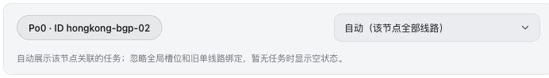

# SAO · JKSR Modded 审查版

版本：`1.1.5-jksr.1`。主题短名保持 `sao`，继续读取 `/api/themes/sao/config`，升级后沿用既有站点配置。本目录随源码一同提交，用于部署前审查；尚未部署到服务器。

## 修改内容

- 新增逐服务器“跟随全局 / 自动 / 自定义”。使用稳定节点 ID/UUID；自定义可以选择 1–8 个任务并上下调整顺序。任务选择器优先列出该节点已关联的任务，其他任务明确提示需要后台关联。
- 全局多线路支持删除最后一个槽位和“清空槽位”。空数组可以保存；多线路开关开启时，空数组表示每节点自动展示。
- 逐节点自动、自定义优先于全局和旧单线路绑定。跟随全局保留旧逻辑：全局指定多线路优先；多线路空列表自动；单线路模式使用旧绑定，没有绑定时自动展示。
- 旧绑定不会自动删除。设置页提供“迁移旧绑定为自定义”，也可以直接切换为自动；随时切回跟随全局即可恢复旧规则。
- 大卡、小卡、迷你卡、列表共用选线模型。列表保留原主题的响应式设计：窄桌面会隐藏延迟列，宽屏显示所有选定线路。
- 任务已删除或不再关联时保留自定义槽位和顺序，显示无样本；设置页给出不可用/未关联提示。自动模式从节点返回的任务与记录获取线路，不使用名称匹配。离线节点保留历史信息和原离线样式，空数据不会伪造成正常延迟。
- 已不存在的节点设置保留并列出 ID，提供显式清理按钮；改名不影响配置，替换为新 ID 的服务器需要重新设置。
- 逐服务器下拉框复用主题统一组件，箭头垂直居中、右侧保留 12px 内距；390px 手机窗口无水平溢出。
- 新增独立丢包色带。色带使用原始返回的丢包桶，按时间和样本权重计算，缺采样用灰色；不受削峰平滑或断点连线影响。悬停色块可以查看对应时段和丢包率。
- 色带开关只折叠独立区域，曲线向上补位。线路图例用现有 uPlot 实例的 `setSeries` / `setScale` 更新显隐和纵轴：必要的画布重绘仍发生，但不重建实例、不重置横轴缩放。“隐藏全部”也保留图表实例。
- 页脚署名改为 `JKSR Modded`，版本和仓库链接从主题清单读取；保留上游许可证。
- 修复保存失败被吞掉的问题：服务端确认成功才更新本地快照；读取原配置失败时不覆盖服务端内容，未知字段保留，超过 64 KiB 明确报错。
- 修正主题 tar 的目录结构，解压后为 `sao/theme.json`、`sao/dist/index.html`、`sao/preview.png`。

## 配置格式与兼容

主题内部新增字段：

```json
{
  "homepageNodePingSettings": {
    "stable-node-id": { "mode": "custom", "taskIds": [5, 4] },
    "another-stable-id": { "mode": "auto" }
  }
}
```

以上 ID 仅为格式示例，不是你的生产节点或检测任务 ID。缺少逐节点配置等同跟随全局。

Monitor 清单支持的设置类型为基础类型，所以三个复杂线路字段在清单中声明为 JSON 文本：`homepageNodePingSettings`、`homepageMultiPingTaskIds`、`homepagePingBindings`。保存到接口时序列化为字符串，读取时同时兼容历史对象/数组与新 JSON 文本。正常使用无需手写 JSON，请在主题“延迟”页选择。

成功读取服务端配置时，新逐节点设置以服务端为准，本地不能覆盖。旧版本只存在于本浏览器的线路数据，首次升级仍兼容；保存一次后便进入完整的服务端配置流程。请求失败时继续使用最近一次成功配置的本地快照。色带开关属于访客自己的偏好，单独存储在浏览器。

检测任务的创建、执行、关联全部由探针后台负责，本主题只读取任务与历史数据并控制显示。

## 使用你的线路方案

1. 普通服务器：全局选择 zstaticdn 对应的 CT、CU、CM，按希望的顺序排列；普通节点保留“跟随全局”。
2. Po0：选“自定义”，添加它自己关联的 PL、CT-53，并调成所需顺序；或选“自动”展示它返回的全部线路。
3. 点击“保存设置”。配置通过站点接口共享，刷新与其他设备读取同一份配置。
4. 如果想全部按节点关联任务显示，开启全局多线路并清空槽位后保存。逐节点自定义仍保持最高优先级。

## 安装方法

1. 审查当前源码差异、本目录截图与主题安装包。安装前可保存一份当前 `GET /api/themes/sao/config` 响应作为配置备份。
2. 从 [本 Fork 的 Actions](https://github.com/michaeloversea/Monitor-SAO-Mod/actions/workflows/build-package.yml) 下载对应提交成功构建的 `sao-theme-package`，解压外层 ZIP 后得到 `theme.tar.gz`；也可在本地运行 `npm ci`、`npm run package` 生成。审查通过后，在 Monitor 管理后台的主题管理页面上传 `theme.tar.gz`，然后启用 `SAO · JKSR Modded`。
3. 如果直接管理 themes 目录，解压包后应得到 `sao/` 目录，放入 hub 使用的 themes 路径；按你的 hub 部署方式刷新/重载主题。
4. 打开前台主题设置 → 延迟，选择实际节点及任务，然后保存。生产节点的关联任务需要已在后台建立。
5. 强制刷新浏览器以替换旧静态资源。保持主题短名 `sao`，不要将配置写进 dist 文件。

ZIP 是辅助归档；正式上传安装使用 `theme.tar.gz`。

## 验证范围与结果

- 静态检查：ESLint、TypeScript、`git diff --check` 全部通过。
- 全量自动测试：47 个测试文件、348 项测试全部通过；生产构建、tar 和 ZIP 打包全部通过。
- 自动回归：包含优先级、不同节点的任务数量与顺序、旧绑定兼容、空全局槽位、删除任务、关联变化、离线/无记录、取数失败、JSON 配置往返、清空本地后模拟跨设备读取、服务端失败不误报、色带计算以及图表开关实例生命周期。
- 实际浏览器模拟：普通服务器三线、Po0 两线；四种卡片视图；手机设置页无水平溢出；空槽位保存并刷新仍为空；Po0 切换自动时忽略旧单绑定；色带关闭后图表上移且尺寸不变。
- 安装包验证：gzip 完整性、tar 根目录、清单字段、普通文件/目录类型及官方大小上限；ZIP 完整性。
- 截图与接口使用本地模拟数据。真实服务器的安装、数据库写入和实际检测任务关联尚未验证，等待你审查后再进行。

截图：[卡片](cards.jpg)、[逐服务器设置](settings.jpg)、[手机设置](settings-mobile.jpg)、[大卡](large.jpg)、[迷你卡](mini.jpg)、[宽屏列表](list.jpg)、[色带开启](ping-loss-bands.jpg)、[色带关闭](ping-loss-bands-off.jpg)。

本地复查：`npm ci` 后执行 `npm run dev`，打开 `http://127.0.0.1:5173/?mock=1&pingScenario=1`。模拟配置存储在本地模拟专用键中；它不会进入生产主题包。

参考：[Monitor 主题开发规范](https://monitor-document.pages.dev/dev/theme)、[LuminaPlus](https://github.com/guboysky/LuminaPlus)。LuminaPlus 仓库当前仅提供构建产物，本次核对了其中独立色带容器及图表显隐实现，并使用本主题自己的组件和计算逻辑实现。

成品校验数据见 [verification.json](verification.json)，SHA-256 见 [SHA256SUMS.txt](SHA256SUMS.txt)。


